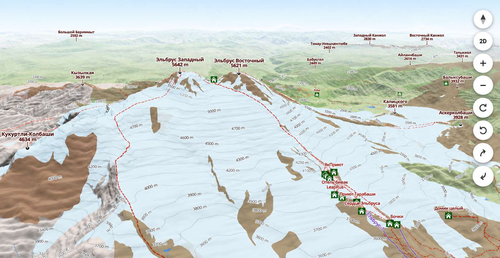

# TopoProfile

TopoProfile is an experimental GIS project for preparing and visualizing
mountain terrain and OpenStreetMap data in an interactive 2D/3D web map.

The current implementation is a regional demo centered around the Elbrus area.

<p align="center">
  
</p>

## Features

- DEM preprocessing and Terrarium terrain generation
- lossless WebP XYZ terrain tiles
- hillshade and elevation contours
- OSM hiking routes, terrain features, infrastructure, and peaks
- interactive 2D/3D visualization with MapLibre GL JS
- incremental geographic data organization using XYZ chunks

## Architecture

TopoProfile separates data acquisition, preprocessing, storage, and
visualization.

```text
topoprofile/
├── processing/     # shared processing abstractions
├── workers/        # task execution
├── terrain/        # DEM processing and terrain storage
├── osm/            # OpenStreetMap processing and storage
└── cli/            # data preparation commands
```

Terrain and OSM pipelines share the same basic processing model:

```text
Source
  ↓
Transform
  ↓
Task
  ↓
Store
```

Tasks operate on geographic XYZ chunks, allowing prepared datasets to be
generated independently and reused by the frontend.

## System requirements

Tested on Ubuntu 24.04 with Python 3.12.

Terrain and contour preprocessing requires GMT and GDAL system tools:

```bash
sudo apt update

sudo apt install -y \
    gmt \
    libgmt-dev \
    gdal-bin
```

## Installation

```bash
git clone https://github.com/OOLebedenko/topoprofile.git
cd topoprofile

python3.12 -m venv .venv
source .venv/bin/activate

pip install -e .
```

## Data preparation

Data preparation commands are implemented in `topoprofile/cli/`.

The Elbrus demo datasets can be generated with:

```bash
python -m topoprofile.cli.prepare_terrain \
    config/regions/elbrus/dem.json

python -m topoprofile.cli.prepare_contours \
    config/regions/elbrus/dem.json

python -m topoprofile.cli.prepare_osm \
    config/regions/elbrus/dem.json
```

Terrain, contours, and OpenStreetMap data are prepared independently and can be
regenerated separately when needed.

The application works with preprocessed geospatial data rather than processing
source DEM and OSM datasets in the browser.

Terrain preparation currently follows this pipeline:

```text
Earth Relief DEM
        ↓
XYZ DEM chunks
        ↓
Terrarium encoding
        ↓
lossless WebP tiles
        ↓
MapLibre 3D terrain
```

Elevation contours and selected OpenStreetMap features are prepared separately
and stored using the same XYZ-based geographic layout.

Prepared data are stored under `data/` and are not intended to be regenerated
on every application deployment.

```text
data/
├── terrain/
│   ├── dem/
│   ├── tiles/
│   └── contours/
└── osm/
```

Only selected mountain regions are prepared locally. The current demo contains
data for the Elbrus area.

## Running locally

At the current stage TopoProfile has no application build step. The frontend is
static and works with previously prepared terrain and OpenStreetMap data.

For a simple local development run, start an HTTP server from the project root:

```bash
python -m http.server 8000
```

Then open:

```text
http://localhost:8000/static/
```

Running the server from the project root makes both the frontend under
`static/` and prepared datasets under `data/` available to the browser.

For deployment, the frontend and prepared data can be served by Nginx. Nginx
is also used as a reverse proxy for external basemap requests.

## Frontend

The frontend is built with MapLibre GL JS and combines:

- a vector basemap
- locally prepared DEM terrain
- hillshade and elevation contours
- prepared OpenStreetMap layers

The frontend provides interactive 2D/3D terrain visualization and loads
prepared geospatial datasets directly from their XYZ-based storage layout.

## Tests

Install development dependencies and run the test suite:

```bash
pip install -e ".[dev]"
pytest
```

## Tech stack

**GIS / processing:** Python, NumPy, rasterio, GDAL, PyGMT, GeoJSON,
OpenStreetMap

**Frontend:** JavaScript, MapLibre GL JS

**Testing:** pytest

## Status

TopoProfile is currently focused on the Elbrus regional demo.

The project originally started from an idea of mountain photo geolocation using
terrain profiles. The current terrain browser is being developed as an
independent GIS application and may also provide the foundation for exploring
that idea in the future.

## License

The source code in this repository is licensed under the MIT License.